# Better Levels Through Survival Instinct：人类本能、空间心理与关卡设计

> 一句话：把“为什么某些空间天然紧张、安心、诱人或危险”翻译成关卡设计师能直接使用的检查表。
>
> 适合谁：关卡设计师、环境叙事设计师、独立游戏开发者、建筑/空间设计爱好者、游戏设计学生。
>
> 阅读价值：这是生存本能、建筑心理和关卡设计之间的桥梁，配有 11 张本地重制图。

## 关键结论

- 关卡空间会调动玩家的生存直觉：视野、庇护、尺度、材质、阴影和高度都会改变安全感与行动欲望。
- “主角弱势问题”不只靠数值补偿解决，空间也可以给玩家可见出口、回撤点和逐步掌控的机会。
- 展望与庇护需要同时存在；只给开阔视野会让玩家暴露，只给安全角落又会让行动失去张力。
- 本文是基于 Totten 原文的设计改写，不把空间心理判断写成未经验证的心理学实验结论。

基于 Christopher W. Totten 在 Game Developer 发表的文章 [Designing Better Levels Through Human Survival Instincts](https://www.gamedeveloper.com/design/designing-better-levels-through-human-survival-instincts) 改写整理。

本文不是逐字翻译稿，而是一篇面向中文关卡设计师的专业改写版。章节顺序、论证主线与案例类型参考原文，文字均重新组织；所有图片均为本地原创重制示意图，用来表达原文配图的设计含义，不复制原网站截图或图片。

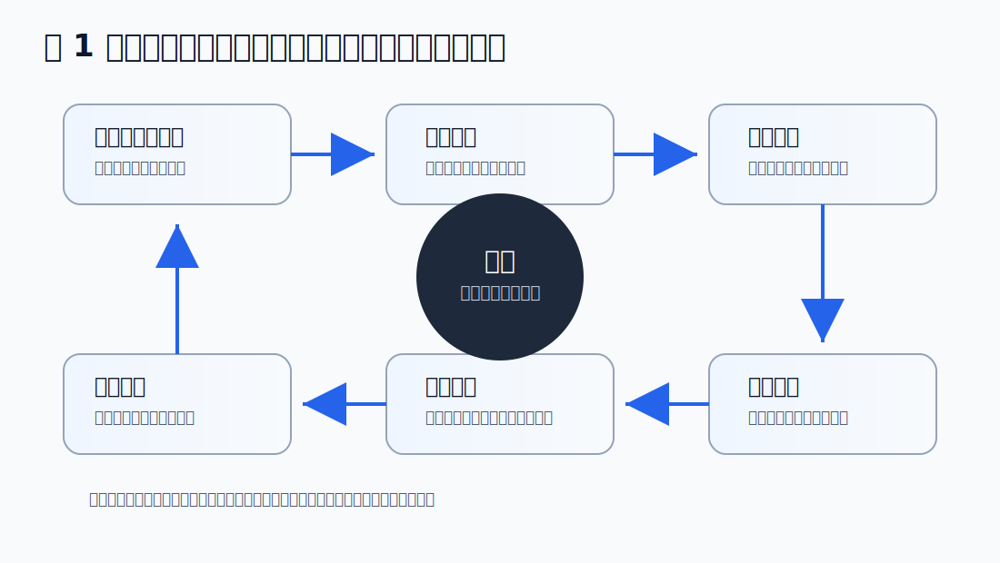

## 导语：关卡为什么会牵动本能

优秀关卡不只是好看的空间，也不只是敌人、道具和门的摆放组合。它更像一台“生存张力机器”：玩家进入一个危险但可理解的环境，在看见风险、寻找庇护、判断路线、克服障碍之后，获得安全抵达、击败强敌或拿到奖励的满足。

这套体验之所以稳定有效，是因为它借用了人类很古老的心理机制。我们会天然关注食物、水源、开阔视野、可退守的位置、黑暗里的不确定、脚下的高度、墙面和地表传达的安全或危险。游戏关卡可以把这些本能转译成玩法：哪里值得去，哪里可能死，哪里能躲，哪里能看，哪里需要勇气穿越。

原文的核心价值在于，它把“关卡设计”从纯粹的几何与任务布局，重新放回到人的身体感和生存直觉里。换句话说，关卡设计师不只是在摆空间，而是在组织玩家的安全感、恐惧感、掌控感与好奇心。

## 一、从生存需求到游戏愉悦

人类最基本的需求包括食物、水、庇护、身体安全和可预测的环境。游戏里的奖励、回血点、存档点、安全屋、可见出口、可攀爬平台、可躲藏阴影，本质上都在模拟这些需求的游戏化版本。

当玩家在危险区域里找到补给，会产生“我还能继续活下去”的感觉；当玩家看见下一个安全平台，会产生“我能计划下一步”的感觉；当玩家从黑暗房间里逃出来，会产生紧张释放。游戏的乐趣并不总是来自轻松，而常常来自“危险被我处理掉了”。

因此，关卡设计中的奖励不应只被理解为数值收益。一个能观察全局的高台、一个临时藏身的壁龛、一扇从背后打开的捷径门，都可以是奖励。它们奖励的是玩家的空间理解，而不只是背包里的物品。

## 二、“主角弱势问题”：玩家为什么需要空间帮助

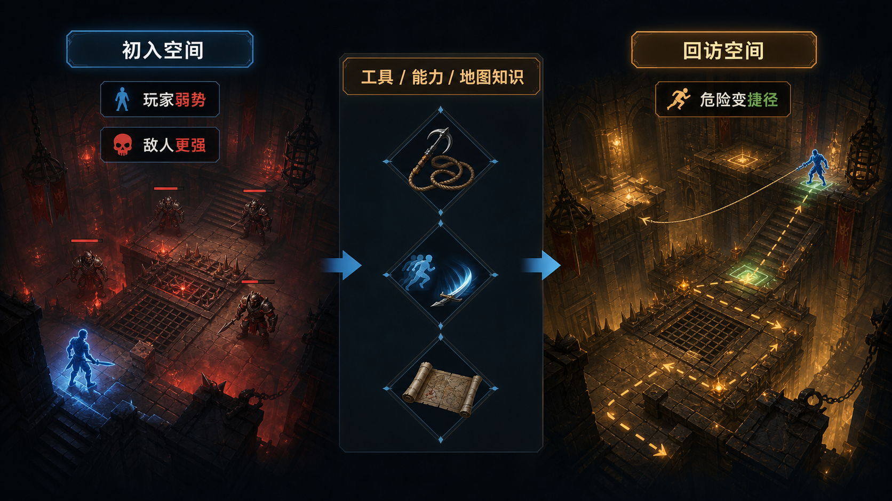

许多游戏主角看起来强大，但从操作层面看，玩家化身往往是弱势的。敌人数量更多、Boss 体型更大、环境信息不完整、路线也常常被锁住。玩家能获胜，不是因为角色天生无敌，而是因为关卡不断提供工具、线索和可学习的空间结构。

这可以解释为什么平台跳跃、银河城、动作冒险和生存恐怖都喜欢让玩家从弱到强。早期房间里的高台、深坑、障碍物和敌人像是在告诉玩家：“你现在还不能随意穿越这里。”等到玩家获得新能力、武器、钥匙或地图知识后，同一个空间会被重新解释。曾经的威胁变成捷径，曾经的墙变成路线，曾经不可战胜的敌人变成可管理的风险。

这种变化对关卡设计非常重要。它说明“成长”不只是角色表上的攻击力增加，而是玩家对空间的掌控权增加。一个好关卡应该让玩家感到：我不是在无脑变强，而是在逐步理解这个地方。

## 三、空间尺度：大、小、窄、开阔都会改变身体感

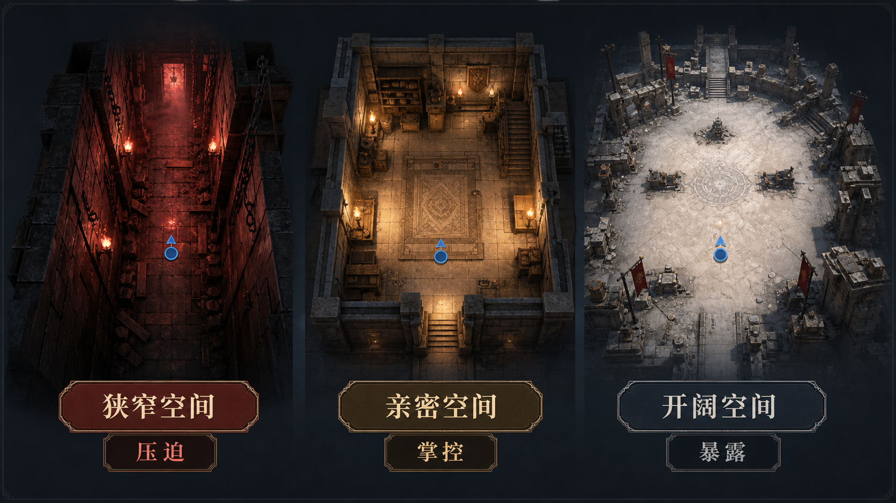

关卡尺寸不是单纯的美术或导航问题，它会直接改变玩家对自己身体的感知。

狭窄空间会放大压迫感。走廊太窄时，玩家难以绕开敌人，转身和撤退都变慢。此时敌人不只是“单位”，更像移动的墙。生存恐怖、地下城、室内近战和追逐桥段经常依赖这种空间逻辑。

亲密空间会带来掌控感。房间不大，但足够玩家观察边界、理解敌人位置、利用掩体和路线。许多教学房、过渡房、谜题房都应该接近这种尺度，因为玩家需要在可控环境里学习规则。

开阔空间则会制造展望与暴露。玩家可以看得很远，但也更容易被看见。Boss 房间、战场中庭、狙击区、大型桥面和广场常用这种尺度。它们的关键不只是“大”，而是让玩家意识到自己正站在一个被环境审视的位置。

在灰盒阶段，设计师可以先问三个问题：玩家在这里能否快速理解边界？移动能力是否能覆盖主要空间？如果敌人出现，玩家是感到“我可以应对”，还是“我被空间困住了”？

## 四、展望与庇护：玩家需要看见危险，也需要相信自己能活下来

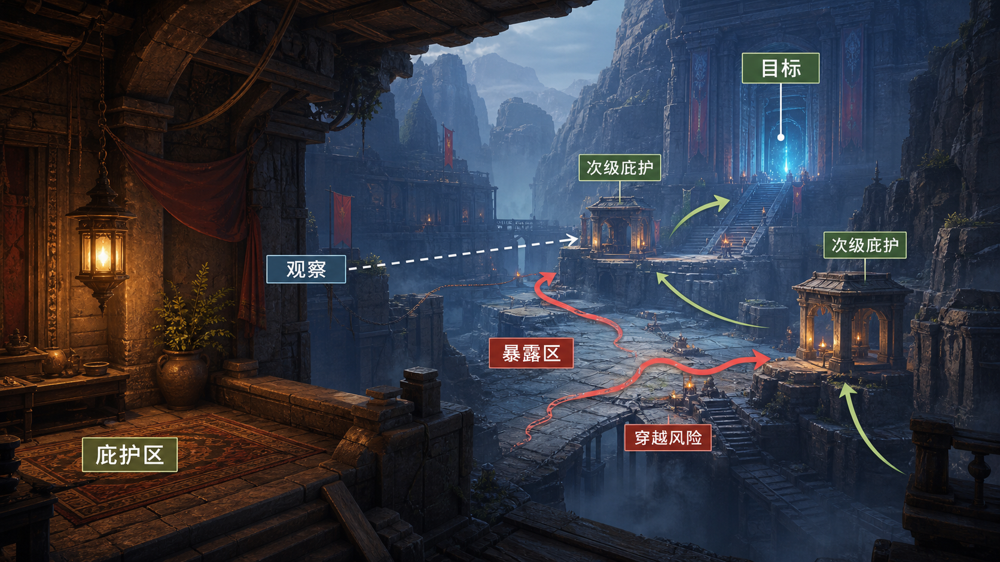

建筑学里常说的“展望与庇护”非常适合解释关卡体验。展望是能看见远处、掌握信息；庇护是有遮挡、有退路、身体不完全暴露。人类会偏爱既能观察环境、又不容易被攻击的位置。

在游戏里，这种关系几乎无处不在。一个门口前的小掩体、一个能俯视敌人的窗口、一个从高处观察庭院的阳台、一个进入竞技场前的准备间，都在扮演“庇护点”。玩家从这里观察暴露区域，决定下一步是否穿越、潜行、交战或绕路。

如果一个关卡只有展望，没有庇护，玩家会觉得自己被迫暴露；如果只有庇护，没有展望，玩家会觉得空间沉闷、缺乏目标。真正有效的推进节奏通常是：安全点、观察、穿越风险、抵达次级安全点、再次观察。

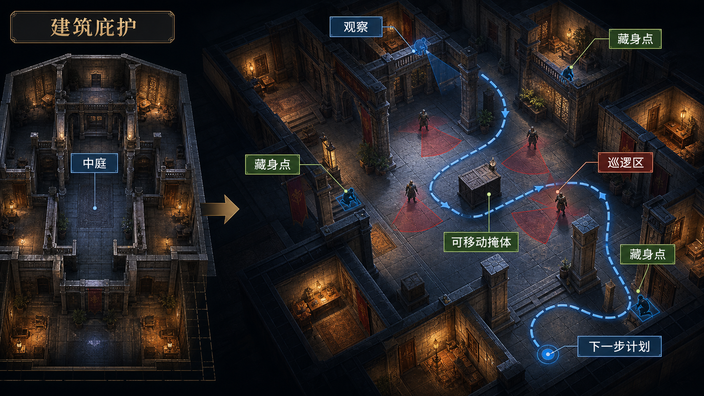

潜行游戏尤其依赖这种结构。阴影、柜子、掩体、柱子、转角、可移动箱子都不是单纯的“躲藏点”，而是玩家用来理解巡逻路线、重置风险和计划下一步的界面。庇护点越清晰，玩家越敢主动穿越危险。

但庇护不能无限稳定。稳定到没有代价的庇护会变成漏洞，玩家只会原地等待。好的庇护通常有观察角度、声音代价、时间窗口或被反制的可能。

## 五、敌人等级会改变空间的庇护密度

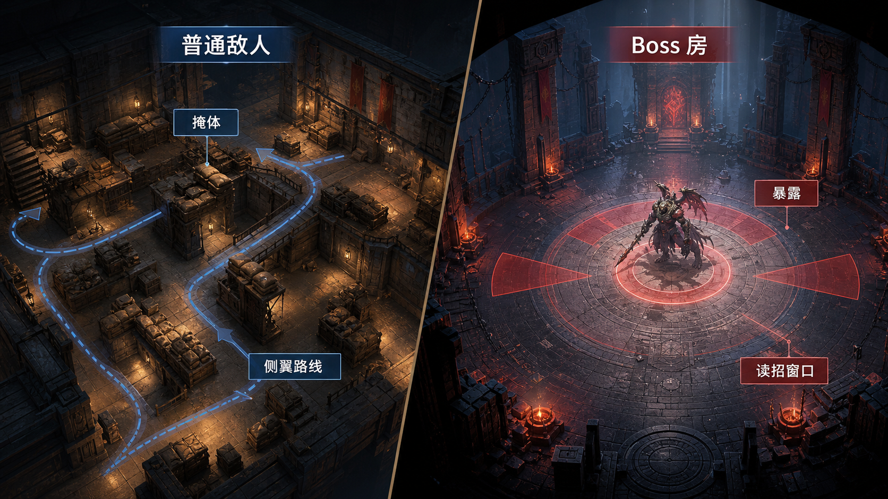

同一个游戏系统里，不同敌人类型需要不同的空间密度。

普通敌人区域通常需要更多平台、掩体、转角和次级路线。玩家需要用空间来拆解战斗：躲开远程攻击、绕到侧面、拉开距离、重新进入战斗。这类空间让玩家感到“我有办法处理它”。

Boss 区域则常常相反。为了突出强敌，空间会故意变开阔，庇护会变少，玩家被迫暴露在 Boss 的攻击范围里。这里的设计目标不是让玩家永远有地方躲，而是让玩家读懂攻击节奏、学习安全窗口，并在有限退路中做出判断。

这也是为什么许多 Boss 房会像舞台：边界清楚、目标醒目、逃避空间有限。空间在这里不是为了保护玩家，而是为了把玩家和强敌放在同一个清晰的冲突场里。

## 六、阴影、遮蔽光与气氛性不确定

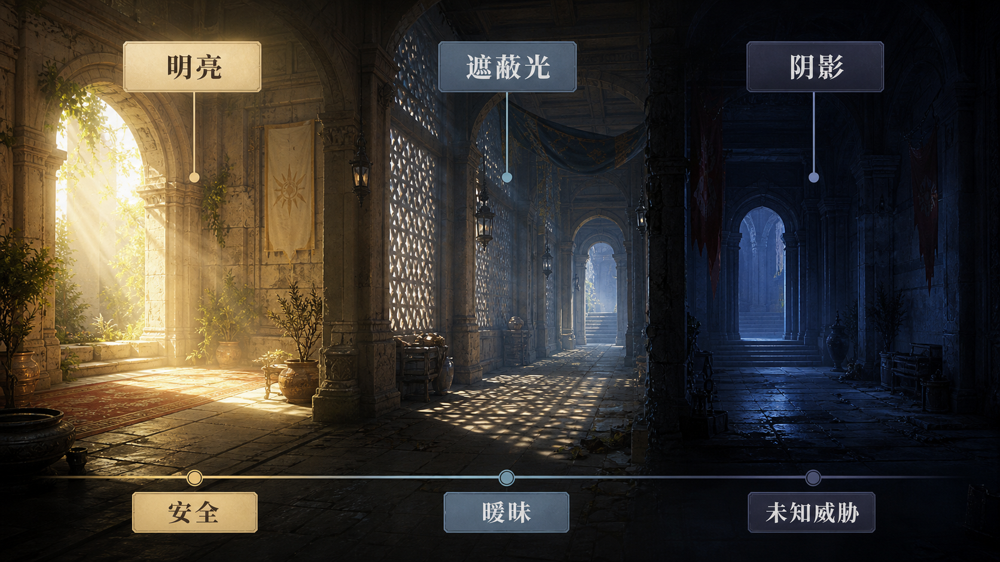

光影并不只是画面气氛。它会改变玩家对空间含义的判断。

可以把黑暗大致分成两类。一类是阴影，它隐藏对象，让玩家不知道里面是否有敌人、陷阱或路线。另一类是遮蔽光，它并不完全隐藏物体，而是让物体的意义变得暧昧。前者制造恐惧，后者制造神秘。

完全黑暗通常不是好设计。它会让玩家从“害怕未知”变成“看不见所以烦”。有效的黑暗应该保留一些线索：轮廓、声源、微弱光斑、反光材质、远处出口、被照亮的奖励。玩家越能推测，越会参与想象。

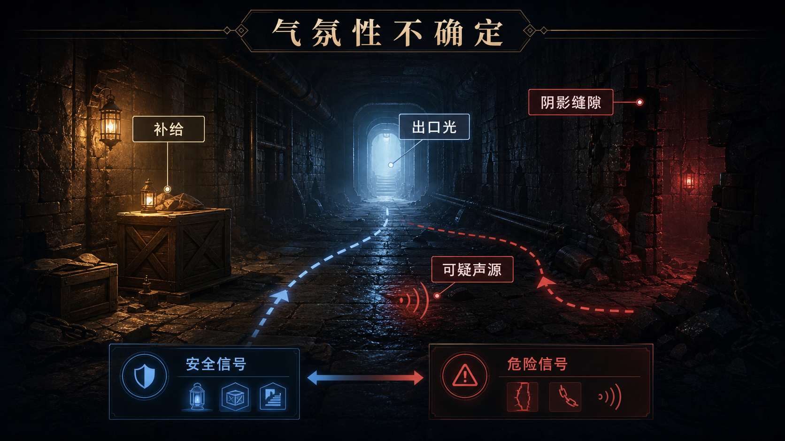

原文强调的“气氛性不确定”可以理解为：环境同时给出安全和危险的信号，让玩家无法立即把空间归类。比如一条隧道里有补给箱，但补给旁边有阴影缝隙；远处有蓝色光源，但光源后面传来声音；走廊看似通往出口，但地上有战斗痕迹。

这种不确定非常适合恐怖、潜行、探索和高风险区域。它不靠突然吓人，而靠让玩家持续推理：“这里到底是不是陷阱？”

## 七、材质旅程：地表和墙面会告诉玩家自己离家有多远

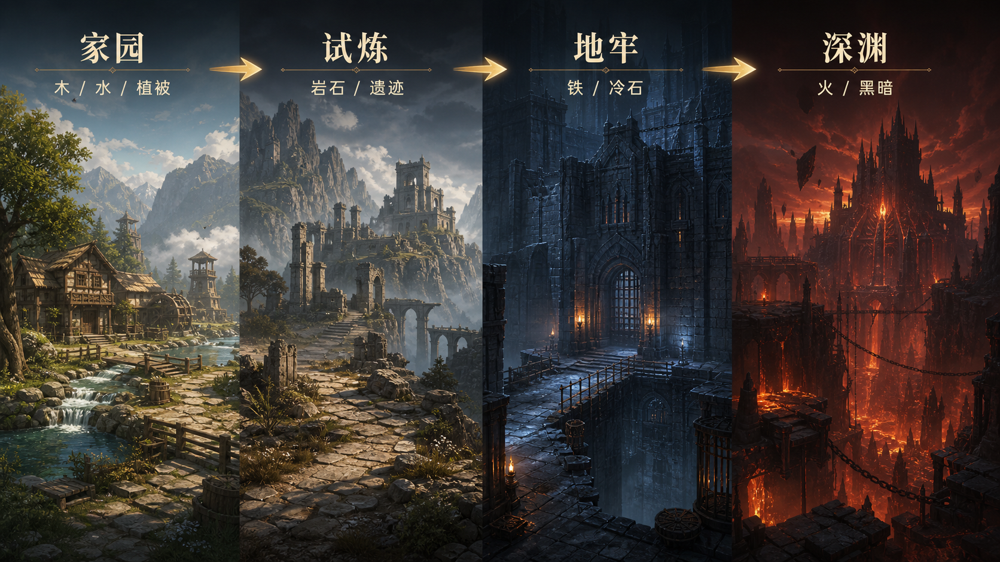

关卡中的材质会不断告诉玩家“这里是否适合生存”。木材、草地、清水、暖光和可居住建筑往往传递安全；岩石、悬崖、遗迹、潮湿石墙、铁门、污染、火焰和深渊则会逐步剥离安全感。

很多冒险游戏的区域顺序都暗合这种材质旅程：从村落和森林出发，穿过洞穴、山地、遗迹、地牢，最后抵达火山、深渊、黑暗城堡或异化空间。玩家未必会有意识地分析材料，但身体会读懂这些变化。

材质设计的价值在于，它能在文字说明之前建立预期。玩家看到木屋和水井，会期待补给、NPC 或教学；看到铁门、污水、碎石和强对比光影，会开始准备战斗或陷阱。

因此，区域难度升级不应只靠敌人血量和伤害。更高级的做法是让材质、声音、地表、光色和空间尺度同步变化，使玩家在进入危险前已经感到自己正在离开熟悉世界。

## 八、高度：高点不是天然安全，深渊也不是单纯装饰

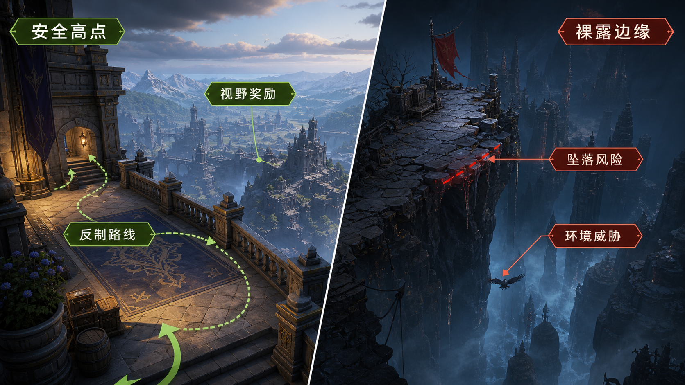

高度在关卡里有两种相反作用。

一种是庇护型高度。玩家站在高处，可以观察下方敌人、规划路线、发动远程攻击。这种高点通常需要栏杆、墙体、退路和被反制的路径，否则会变成无解优势。一个健康的高点应该是可争夺的奖励，而不是单方面压制全场的位置。

另一种是展望型危险。悬崖边、断桥、深坑、楼顶边缘会让玩家感到暴露和眩晕。这里的威胁不一定来自敌人，也来自地形本身。垂直线条、下方黑暗、坠落声音、窄边平台和缺失护栏都能强化这种感觉。

高度设计尤其需要注意“公平的恐惧”。玩家可以害怕坠落，但不应因为镜头、碰撞或边界不清而莫名失败。危险可以强烈，但信息必须可读。

## 九、把本能原则落到关卡审核

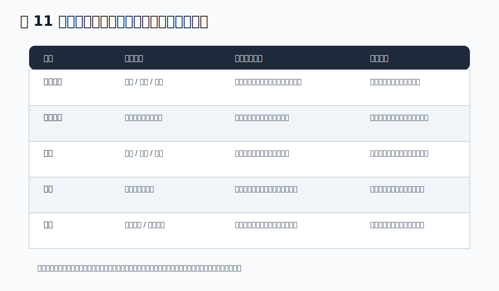

如果把原文观点转化为实用审核表，可以从五个维度检查关卡。

空间尺度：这个区域让玩家觉得压迫、掌控还是暴露？这种感受是否服务当前目标？

展望与庇护：玩家离开安全点之前，能否看见下一处可能的安全点或目标？是否存在过于稳定、无需代价的安全位？

光影：黑暗是否在提供信息和悬念，而不是单纯阻碍视认？遮蔽光是否让空间更神秘，而不是让导航更混乱？

材质：区域危险度是否能通过材质、颜色、声音和地表状态被预读？玩家能否感到自己正在从安全世界进入危险世界？

高度：高点是否可争夺、可反制？悬崖和深坑的危险是否清晰、可理解、可避免？

这套检查并不替代敌人设计、任务设计或数值平衡，但它能帮助关卡设计师在灰盒阶段更早发现问题。很多关卡并不是因为路线少而失败，而是因为玩家无法判断自己为什么紧张、为什么安全、为什么值得前进。

## 十、给搜打撤与动作关卡的补充启发

对于搜打撤、PvPvE、潜行射击、近战 ARPG 或室内探索游戏，这篇文章的启发尤其直接。

撤离点应该同时具备展望与庇护关系。玩家需要看见撤离承诺，但不能拥有完全安全的结算按钮。撤离点周围应有多条进出路径、反蹲点结构、声音代价或视线遮挡。

高价值房间应该有进入剧本。正门可以快但吵，侧门可以慢但隐蔽，垂直入口可以强但有暴露代价。玩家不是简单“开门拿货”，而是在选择一种风险。

Boss 房和高价值区域不应只是更大。它们应该改变玩家的身体感：更开阔、更暴露、更难获得稳定庇护，同时给出清楚的攻击节奏和撤退承诺。

外圈低风险区域也不应只是填充空间。它们可以提供恢复、情报、低价值收益、绕行路线和二次进入机会。没有外圈庇护，玩家就只剩下冲热点或放弃两种选择。

## 资料与图像说明

正文图片用于帮助读者把“生存本能”转成可讨论的关卡设计问题。它们不是对某个游戏场景的复刻，而是把空间尺度、展望与庇护、材质、光影和高度这些抽象概念压缩成便于阅读的本地示意图。需要追溯原文意图或继续阅读时，可以从本节查。

### 图像阅读说明

| 本文重制图 | 对应原文意图 |
| --- | --- |
| 图 1 生存本能转译链路 | 对应原文关于生存需求、快乐与游戏机制之间关系的总论 |
| 图 2 主角弱势问题 | 对应原文关于玩家化身弱势、能力成长和回访空间的案例组 |
| 图 3 空间尺度 | 对应原文关于狭窄、亲密、开阔空间对情绪和战斗的影响 |
| 图 4 展望 / 庇护推进 | 对应原文对 prospect-refuge 理论的关卡化说明 |
| 图 5 建筑到潜行玩法 | 对应原文把建筑空间、学校案例、潜行游戏藏身点联系起来的部分 |
| 图 6 小敌人与 Boss 空间 | 对应原文关于普通敌人场景与 Boss 场景庇护差异的案例 |
| 图 7 Shadow / Shade | 对应原文对阴影、遮蔽、神圣感和恐惧感的区分 |
| 图 8 气氛性不确定 | 对应原文关于黑暗、隧道、歧义和心理悬念的案例组 |
| 图 9 材质旅程 | 对应原文关于水、岩石、火、材质升级与英雄旅程的部分 |
| 图 10 高度 | 对应原文关于高处、展望、庇护和坠落风险的总结 |
| 图 11 关卡审核表 | 将全文观点转为灰盒和试玩阶段可用的设计检查表 |

### 延伸阅读

原文作者在文章末尾推荐了一组跨学科书目，适合关卡设计师继续补课：

- 《Universal Principles of Design》
- 《A Pattern Language》
- 《Game Design Workshop》
- 《Rules of Play》
- 《Emotional Design》
- 《Drawing for Landscape Architecture》
- 《Level Design: Concept, Theory, and Practice》
- 《An Architectural Approach to Level Design》

这些书覆盖设计原则、建筑模式、游戏规则、情感设计、景观表达和关卡理论。若要把“生存本能”真正转化为可制作的关卡，它们比单看游戏截图更有帮助。
